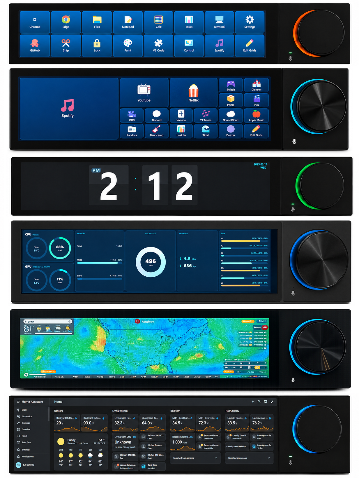

# open-quake

An open driver and touchscreen launcher for the **DK-QUAKE / ARIS-68** — the
1920×480 touchscreen-plus-knob macro device (sold with the closed-source
DK-Suite app). `open-quake` talks to it directly over HID, with no vendor
software running.



*From top: the grid launcher · the flip-clock app · web dashboards — [Flipoff](https://github.com/TeeJS/flipoff) and [Home Assistant](https://www.home-assistant.io).*

### **[⬇ Download for Windows](https://github.com/TeeJS/open-quake/releases/latest)** &nbsp;·&nbsp; or build from source (below)

It gives you:

- **A multi-grid launcher** — each page is a grid of tiles; tap a tile to open an
  app, URL, shell command, file, or system action (lock screen). A tile's icon
  can be an emoji, the program's own icon, or a custom image.
- **Web dashboard pages** — a page can instead be a live web view (Home Assistant,
  Grafana / server monitoring, a status page, …) shown full-screen on the panel:
  the knob scrolls it, a tap clicks, and logins persist across restarts. Pages that
  need auth can inject a Home Assistant long-lived token, HTTP Basic Auth, or custom
  header(s) (bearer / Cloudflare Access) — set per page in the editor.
- **Knob control** — rotate for volume (or to scroll the current dashboard),
  single-click to mute, **double-click to open the page selector** (rotate to
  pick a page by name, press to switch).
- **A PC-side editor** — build pages of tiles (each opens an app / URL / shell
  command / file or a system action) with an emoji, app, or image icon; **merge**
  adjacent tiles into one larger button; **drag-and-drop** to rearrange; then
  **Save** to push to the panel.

> **Status:** early. Touch, knob, grids, web dashboards, and the editor are
> working and validated against real hardware. The panel is driven as a normal external
> monitor (Windows sees a 480×1920 / 1920×480 display); pushing frames over the
> HID resource channel is not implemented.

## Download

Grab a build from the **[Releases](https://github.com/TeeJS/open-quake/releases)** page (Windows x64):
- **`open-quake-<version>-portable.exe`** — run directly, no install.
- **`open-quake-<version>-setup.exe`** — installer (Start-menu shortcut + uninstaller).

The exe isn't code-signed, so Windows SmartScreen warns on first launch — click
**More info → Run anyway**. Plug in the DK-QUAKE, then launch; config is stored in
`%APPDATA%\open-quake`. (Linux/macOS builds would need platform-specific launch/volume
work — not done yet.)

## Hardware

The DK-QUAKE's screen is a standard external monitor (HDMI or USB-C DisplayPort
alt-mode) recognized by Windows as a 480×1920 portrait display. A separate USB
link handles touch and control/knob/mic interfaces. Video travels over the
display cable; open-quake renders an Electron window onto that monitor, exactly
as DK-Suite did. Unplug the display cable and the panel goes dark, but the USB
side keeps working.

The USB side is two HID interfaces: a control interface (knob, mic/state,
firmware, keep-alive) and a multi-touch interface. The panel ships dark and
idle-blanks; the driver wakes it and sends a periodic keep-alive so it stays on.
The on-board mic enumerates as a standard **"5- USB PnP Audio Device"** — any app
can read it directly; `open-quake` doesn't wrap it.

## Dashboards

A page can be a web view instead of a tile grid (**+ Dashboard** in the editor —
give it a name + URL). It renders full-screen on the panel; the knob scrolls it
(inner scroll panels included), a tap is a click, and double-clicking the knob
returns to the page selector. Sessions persist across restarts.

**Auth** is set per page in the editor — needed because the panel has no keyboard:

| Type | For |
|---|---|
| **None** | public / anonymous pages (Flipboard, anonymous Grafana) |
| **Home Assistant token** | HA — paste a Long-Lived Access Token; the panel seeds it and loads signed-in |
| **HTTP Basic Auth** | sites behind a real `401` / `WWW-Authenticate: Basic` challenge (e.g. nginx `auth_basic`) |
| **Custom header(s)** | bearer tokens, Grafana service accounts, Cloudflare Access (`CF-Access-Client-Id` / `-Secret`) |

**Form-login apps** — which redirect to a `/login` *page* instead of issuing a
`401` — aren't covered by Basic Auth. Either have the app accept a **bearer token**
and use Custom header, or, since the panel runs on your PC, click the login form
with your PC mouse/keyboard once: the persistent session keeps you signed in.

## Editor

Open it from the panel's **Edit Grids** tile (it appears on your PC). The left
list holds your **pages** — each is a tile **Grid**, a web **Dashboard**, or a bundled **App**.

On a grid page you can:
- **Edit tiles** — label, action (app / URL / shell command / open file / system),
  and icon (emoji, the program's own icon, or a custom image).
- **Merge** — click a tile, **Shift-click** another to select a block, then **Merge**
  to show them as one larger button (Unmerge to split).
- **Rearrange** — **drag-and-drop** to swap tiles; drag a merged block to move it
  (tiles it lands on slide into the freed cells).
- **Resize** the grid (columns × rows).

Edits apply on **Save** — nothing changes on the panel until then. Which page is
*shown* is controlled by the **knob** (double-click → page selector), not the
editor, so editing never changes what's live.

## Apps

Bundled local web apps live in `apps/`, listed in `apps/apps.json` (each with a
name, file, and an options schema). In the editor, **+ App** adds an app page:
pick the app and set its options — open-quake loads it full-screen on the panel,
no server and no hand-typed URLs.

Included: **Flip Clock** — split-flap animation, 12/24-hour, dark/classic theme,
optional seconds, and a corner date/day. (12-hour shows a single hour card with an
AM/PM badge; 24-hour shows two hour cards.)

Write your own: drop an HTML file in `apps/` that reads its settings from the URL
**hash** (e.g. `…/myapp.html#color=red`) — a `?query` doesn't survive a `file://`
load — and add an entry to `apps/apps.json` describing its options.

## Layout

```
src/Aris68Connector.js   the HID driver (events out, commands in)   [PolyForm NC]
docs/DEVICE_PROTOCOL.md   reverse-engineered protocol spec           [PolyForm NC]
tools/                    standalone HID probe / write-test scripts  [PolyForm NC]
app/                      the Electron launcher + PC grid editor     [MIT]
  main.js                 host: windows, IPC, launch/volume/config
  index.html              the on-panel UI (grids + web dashboards)
  config.html             the PC editor (pages, tiles, icons)
  config.default.json     seed config (copied to config.json on first run)
apps/                     bundled local web apps + apps.json manifest [MIT]
```

## Build & run (Windows)

The native modules (`node-hid`, `robotjs`) must be built for this app's Electron
ABI (**Electron 23**), *not* your host Node. A plain `npm install` fails —
`robotjs` (0.6.0) can't compile against modern Node. So install without scripts,
fetch the Electron binary, then rebuild the natives against Electron 23:

```powershell
npm install --ignore-scripts            # packages on disk, no native build
node node_modules/electron/install.js   # fetch the Electron 23 binary
npm run rebuild                          # electron-rebuild -v 23.0.0 -f  (node-hid + robotjs)
npm start
```

Building the natives on modern Windows needs Visual Studio 2022 Build Tools
(Desktop C++ workload) and a Python with `distutils` (`pip install
"setuptools<81"` on Python 3.12+). Set `GYP_MSVS_VERSION=2022` if node-gyp picks
the wrong toolset.

Plug in the DK-QUAKE before `npm start`. The launcher finds the panel display,
places a borderless window on it, wakes the backlight, and starts listening for
touch and knob input.

Set the DK-QUAKE's **display orientation to Landscape** in Windows (Settings →
System → Display) so Windows treats it as a 1920×480 landscape display — that
keeps the mouse and touch aligned with what you see. open-quake auto-rotates its
render if you leave it portrait, but then a desktop mouse moved onto the panel
reads 90° off.

## Licensing

Split-licensed — see **[NOTICE](NOTICE)**:

- **MIT** ([LICENSE](LICENSE)) — the launcher and editor (`app/`), original work.
- **PolyForm Noncommercial 1.0.0** ([src/LICENSE](src/LICENSE)) — every file that
  embeds the reverse-engineered protocol: the driver (`src/Aris68Connector.js`),
  the protocol notes (`docs/DEVICE_PROTOCOL.md`), and the two `tools/` scripts.
  The vendor described the comm protocol as restricted for commercial use; these
  files are **non-commercial only** unless you obtain written commercial
  permission from the protocol holders.

No vendor code, binaries, or API keys are included in this repository.

## Safety

`Aris68Connector.js` knows the firmware-download (DFU) command but never sends
it. **Do not call `enterDfu()`** — it puts the device into firmware-flash mode
and can brick it. The write-test in `tools/` only issues read-only query frames.
